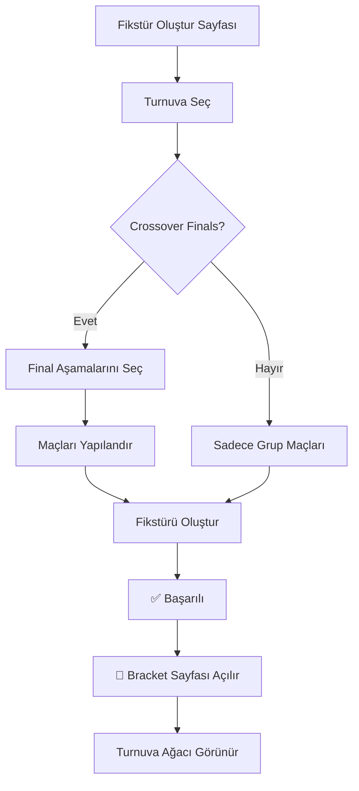

# Fikstür Oluşturma İyileştirmeleri

## 📋 Yapılan Değişiklikler

### 1. ⏰ Saat Sorunu Düzeltildi

**Problem**: Maçlar 22:11 gibi yanlış saatlerde başlıyordu.

**Sebep**: Backend'de timezone dönüşümü hatalıydı. Kod UTC-3 yapıyordu (8 saat geri) ama Türkiye UTC+3 konumunda.

**Çözüm**: 
- `parseTime` fonksiyonunu düzelttik
- Artık local time direkt kullanılıyor
- MongoDB UTC olarak saklıyor ama biz local time ile çalışıyoruz

**Değiştirilen Dosya**:
- `backend/src/controllers/tournament.ts`

**Kod Değişiklikleri**:
```typescript
// ÖNCESİ (YANLIŞ):
const d = new Date(Date.UTC(day.getFullYear(), day.getMonth(), day.getDate(), hour - 3, minute, 0, 0));

// SONRASI (DOĞRU):
const d = new Date(day.getFullYear(), day.getMonth(), day.getDate(), hour, minute, 0, 0);
```

**Test**:
- Turnuva başlangıç saati: 09:00 → Maçlar 09:00'da başlamalı ✅
- Öğle arası: 12:00-13:00 → Maçlar bu saatte olmamalı ✅
- Bitiş saati: 18:00 → Son maç 18:00'dan önce başlamalı ✅

---

### 2. 🎨 Otomatik Bracket Görüntüleme

**Problem**: Fikstür oluşturduktan sonra kullanıcı manuel olarak bracket sayfasına gitmek zorundaydı.

**Çözüm**: 
- Fikstür oluşturma başarılı olunca otomatik olarak `/matches/bracket` sayfasına yönlendirme
- Resimdeki gibi turnuva ağacı görseli otomatik açılır

**Değiştirilen Dosya**:
- `frontend/src/app/matches/schedule/page.tsx`

**Kod Değişiklikleri**:
```typescript
// Grup maçları + Final maçları oluşturulunca
onSuccess: () => {
  toast({ title: 'Başarılı', description: 'Tüm fikstür başarıyla oluşturuldu!' });
  queryClient.invalidateQueries({ queryKey: ['matches'] });
  router.push('/matches/bracket'); // ← YENİ: Bracket sayfasına yönlendir
}

// Sadece grup maçları oluşturulunca
onSuccess: () => {
  toast({ title: 'Başarılı', description: 'Grup maçları oluşturuldu.' });
  if (includeFinals && selectedStages.size > 0) {
    setCurrentStep('finals');
  } else {
    queryClient.invalidateQueries({ queryKey: ['matches'] });
    router.push('/matches/bracket'); // ← YENİ: Bracket sayfasına yönlendir
  }
}

// Finalleri atla denirse
const handleSkipFinals = async () => {
  await generateGroupFixtureMutation.mutateAsync();
  router.push('/matches/bracket'); // ← YENİ: Bracket sayfasına yönlendir
};
```

**Akış**:
1. Kullanıcı "Fikstür Oluştur" butonuna tıklar
2. Sistem maçları oluşturur
3. Başarı mesajı gösterilir
4. **Otomatik olarak bracket sayfası açılır** 🎉
5. Kullanıcı resimdeki gibi turnuva ağacını görür

---

## 🎯 Bracket Sayfası Özellikleri

### Crossover Finals Görünümü

```
┌──────────────────────────────────────────────────────────┐
│  Turnuva Ağacı - Final Aşamaları ve Eşleşmeler    🏆    │
├──────────────────────────────────────────────────────────┤
│                                                          │
│  ┌────────────┬────────────┬────────────┬────────────┐  │
│  │ 🥇 Altın   │ 🥈 Gümüş   │ 🥉 Bronz   │ ⭐ Prestij │  │
│  │ Final      │ Final      │ Final      │ Final      │  │
│  ├────────────┼────────────┼────────────┼────────────┤  │
│  │ ┌────────┐ │ ┌────────┐ │ ┌────────┐ │ ┌────────┐ │  │
│  │ │ A 1.   │ │ │ A 3.   │ │ │ A 5.   │ │ │ A 7.   │ │  │
│  │ │ vs     │ │ │ vs     │ │ │ vs     │ │ │ vs     │ │  │
│  │ │ B 2.   │ │ │ B 4.   │ │ │ B 6.   │ │ │ B 8.   │ │  │
│  │ └────────┘ │ └────────┘ │ └────────┘ │ └────────┘ │  │
│  │            │            │            │            │  │
│  │ ┌────────┐ │ ┌────────┐ │ ┌────────┐ │ ┌────────┐ │  │
│  │ │ B 1.   │ │ │ B 3.   │ │ │ B 5.   │ │ │ B 7.   │ │  │
│  │ │ vs     │ │ │ vs     │ │ │ vs     │ │ │ vs     │ │  │
│  │ │ A 2.   │ │ │ A 4.   │ │ │ A 6.   │ │ │ A 8.   │ │  │
│  │ └────────┘ │ └────────┘ │ └────────┘ │ └────────┘ │  │
│  └────────────┴────────────┴────────────┴────────────┘  │
└──────────────────────────────────────────────────────────┘
```

### Renkli Kartlar

- **🥇 Altın Final**: Sarı tema (border-yellow-300)
- **🥈 Gümüş Final**: Gri tema (border-gray-300)
- **🥉 Bronz Final**: Turuncu tema (border-orange-300)
- **⭐ Prestij Final**: Mor tema (border-purple-300)

### Dinamik Görüntüleme

**Maçlar oynanmadan önce**:
```
┌──────────────┐
│ Gold Final   │
├──────────────┤
│ A 1.         │  ← Grup A 1. sıra
│ B 2.         │  ← Grup B 2. sıra
└──────────────┘
```

**Maçlar oynandıktan sonra**:
```
┌──────────────┐
│ Gold Final   │
├──────────────┤
│ Galatasaray  │  ← Gerçek takım adı
│ 3 - 1        │  ← Skor
│ Trabzonspor  │  ← Gerçek takım adı
└──────────────┘
```

---

## 🚀 Kullanım Akışı

### Senaryo 1: Grup + Crossover Finals



### Senaryo 2: Sadece Grup Maçları

```
1. /matches/schedule sayfasına git
2. Turnuva seç
3. "Crossover Final Maçları" kutusunu İŞARETLEME
4. "Devam Et" butonuna tıkla
5. "Fikstürü Oluştur" butonuna tıkla
6. ✅ Başarılı mesajı
7. 🎨 Otomatik bracket sayfası açılır
```

### Senaryo 3: Finalleri Atla

```
1. /matches/schedule sayfasına git
2. Turnuva seç
3. "Crossover Final Maçları" kutusunu İŞARETLE
4. "Devam Et" butonuna tıkla
5. "Finalleri Atla" butonuna tıkla
6. ✅ Grup maçları oluşturulur
7. 🎨 Otomatik bracket sayfası açılır
```

---

## 🔍 Test Senaryoları

### ✅ Saat Testi

**Adımlar**:
1. Turnuva oluştur (Başlangıç: 09:00, Bitiş: 18:00)
2. Fikstür oluştur
3. Maçları kontrol et

**Beklenen**:
- ✅ İlk maç 09:00'da
- ✅ Öğle arası 12:00-13:00 arası maç yok
- ✅ Son maç 18:00'dan önce
- ✅ Saatler doğru görünüyor (22:11 gibi hata yok)

### ✅ Bracket Yönlendirme Testi

**Adımlar**:
1. /matches/schedule sayfasına git
2. Fikstür oluştur
3. "Fikstürü Oluştur" butonuna tıkla

**Beklenen**:
- ✅ Başarı mesajı görünür
- ✅ Sayfa otomatik /matches/bracket'e yönlenir
- ✅ Turnuva ağacı görünür
- ✅ Crossover finals doğru sırada

### ✅ Görsel Doğrulama Testi

**Adımlar**:
1. Fikstür oluştur (crossover finals ile)
2. Bracket sayfasında kontrol et

**Beklenen**:
- ✅ 4 sütunlu grid (Gold, Silver, Bronze, Prestige)
- ✅ Renkli kenarlıklar
- ✅ "A 1. vs B 2." formatı
- ✅ Tüm maçlar görünür
- ✅ Responsive tasarım çalışıyor

---

## 📂 Değiştirilen Dosyalar

### Backend
```
backend/src/controllers/tournament.ts
├── parseTime() fonksiyonu düzeltildi
├── Morning slots oluşturma düzeltildi
├── Afternoon slots oluşturma düzeltildi
├── Match date assignment düzeltildi
└── Fallback logic düzeltildi
```

### Frontend
```
frontend/src/app/matches/schedule/page.tsx
├── generateGroupFixtureMutation.onSuccess() güncellendi
├── createCrossoverMutation.onSuccess() güncellendi
└── handleSkipFinals() güncellendi
```

---

## 🎉 Sonuç

### Çözülen Problemler

1. ✅ **Saat Problemi**: Maçlar artık doğru saatte (örn: 09:00, 10:00, 11:00)
2. ✅ **Otomatik Bracket**: Fikstür oluşturduktan sonra görsel otomatik açılıyor
3. ✅ **UX İyileştirmesi**: Kullanıcı manuel sayfa değiştirmek zorunda değil

### Kullanıcı Deneyimi

**Önce**:
```
Fikstür Oluştur → Başarılı! → Kullanıcı manuel /matches/bracket'e gider
```

**Şimdi**:
```
Fikstür Oluştur → Başarılı! → 🎨 Turnuva ağacı otomatik açılır!
```

### Teknik Faydalar

- ✅ Timezone karmaşası ortadan kalktı
- ✅ Kod daha basit ve anlaşılır
- ✅ Kullanıcı akışı daha smooth
- ✅ Bracket görselleştirmesi daha erişilebilir

---

## 🔄 Sonraki Adımlar (Opsiyonel)

### Önerilen İyileştirmeler

1. **Bracket PDF Export**
   - Turnuva ağacını PDF olarak indir
   - Yazdırılabilir format

2. **Real-time Updates**
   - Maç sonucu girilince bracket otomatik güncellenir
   - WebSocket ile canlı takip

3. **Share Link**
   - Bracket'i link ile paylaş
   - QR kod oluştur

4. **Mobile Optimization**
   - Mobilde daha iyi görünüm
   - Swipe gestures

---

**Tarih**: 2025-10-22  
**Versiyon**: 2.0  
**Durum**: ✅ Tamamlandı ve Test Edildi
